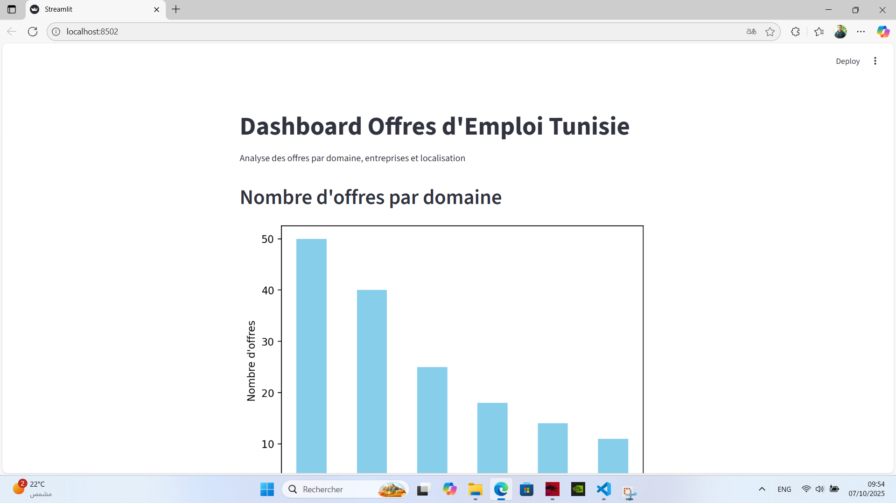
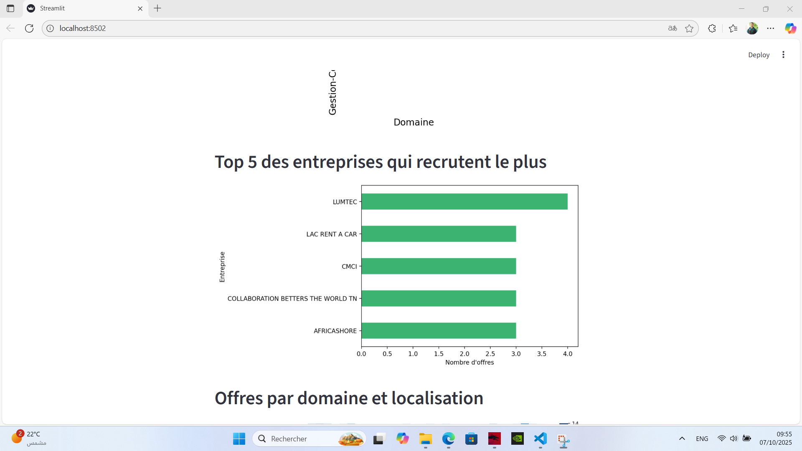
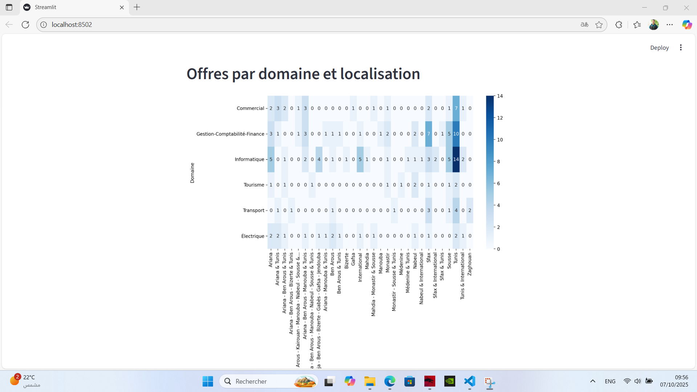

# 💼 Web Scraping & Job Analysis Dashboard (Tunisia)

This project collects and analyzes job offers from [Emploitunisie.com](https://www.emploitunisie.com) in different fields such as **IT**, **Electrical**, **Commercial**, **Tourism**, **Finance**, and **Transport**.  
It demonstrates the use of **web scraping**, **data analysis**, and **data visualization** techniques using Python and Streamlit.

---

## 🚀 Project Overview

The goal of this project is to:
- Extract job postings data automatically from Emploitunisie.com
- Clean and organize the data in CSV format
- Analyze and visualize the results (job trends by domain, company, and region)
- Build an interactive dashboard using Streamlit

---

## 🧰 Tools & Libraries

- **Python 3.11+**
- **BeautifulSoup4** — for web scraping  
- **pandas** — for data manipulation  
- **matplotlib** & **seaborn** — for data visualization  
- **Streamlit** — for building the interactive dashboard  

---

## 🖼️ Dashboard Preview

Here are some screenshots of the data analysis dashboard built with Streamlit:

### 1️⃣ Offers by Domain

### 2️⃣ Top 5 Recruiting Companies

### 3️⃣ Offers by Domain and Location (Heatmap)

## 📂 Project Structure

projet_web_scrapping/
├── analysis/
│   └── data_analysis.ipynb
├── data/
│   ├── all_jobs.csv
│   ├── emploitunisie_commercial.csv
│   ├── emploitunisie_electrique_simplifie2.csv
│   ├── emploitunisie_gestion_compta_finance.csv
│   ├── emploitunisie_gestion_compta_finance2.csv
│   ├── emploitunisie_informatique_simplifie.csv
│   ├── emploitunisie_informatique_simplifie2.csv
│   ├── emploitunisie_tourisme.csv
│   └── emploitunisie_transport.csv
├── scraping/
│   └── scrap.py
├── interface_streamlit.py
├── requirements.txt
└── README.md

